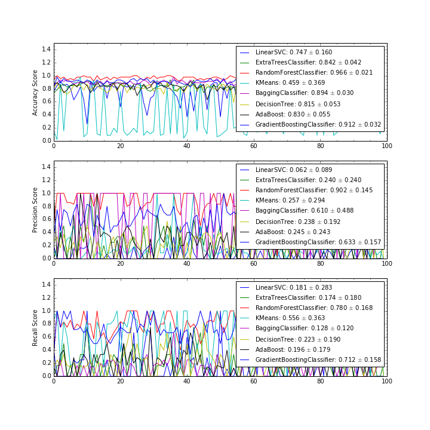

#Enron Free-Response Questions

## Dataset Characteristics
- 145 employees + total
- 18 persons of interest
- 21 features
- Every feature has some missing values, all of which are more than 10% of the data set.
	- loan_advances (142)
	- director_fees (129)
	- restricted_stock_deferred (128)
	- deferral_payments (107)
	- deferred_income (96)
	- long_term_incentive (80)
	- bonus (64)
	- from_this_person_to_poi (60)
	- from_poi_to_this_person (60)
	- shared_receipt_with_poi (60)
	- to_messages (60)
	- from_messages (60)
	- other (53)	
	- salary (51)
	- expenses (49)
	- exercised_stock_options (44)
	- restricted_stock (35)
	- email_address (35)
	- total_payments (21)
	- total_stock_value (19)
	

## Question 1

**Summarize for us the goal of this project and how machine learning is useful in trying to accomplish it. As part of your answer, give some background on the dataset and how it can be used to answer the project question. Were there any outliers in the data when you got it, and how did you handle those?**

A: The goal of this project is to produce a classifier that can accurately classify actual persons of interest from the Enron data set, while minimizing the number of false negatives. There's also a secondary goal of producing potential persons of interest amongst the false positives, who have financial and communication characteristics similar to known persons of interest. For this, Machine Learning is a wonderful tool. By eye we can at best classify by pairs of characteristics at a time, and even then we have trouble combining the results of multiple pairs. With Machine Learning, we can assess all of the data from financial and communication realms together, finding non-obvious relationships that can help with our classification. We can then easily extend those relationships to the full employee list and to a fairly high degree accumulate a list of real and potential persons of interest.

The outliers that I'd found in the data set came in three varieties:

1. Incorrect inputs
2. Employees with total_payments > 0
3. Employees above the 95th percentile in salary, and above the 99.5 percentile in bonuses, total stock value, long term incentives, and email counts from the employee to persons of interest

**The first set contained two outliers.** I encountered them while doing a simple univariate exploration of the data early on. The employees with incorrect inputs were SANJAY BHATNAGAR and ROBERT BELFER. They were simple but tedious to deal with. They required that I simply look directly at the financial data from the accompanying  `enron61702insiderpay.pdf` file, and rewrite the information in the raw data dictionary. The tedious part was making sure that there were no other employees with incorrectly-input data. These outliers were not removed from the data set, just reincorporated with the appropriate information. **The second set contained 21 outliers** This is a decent fraction of the overall set, comprising ~14.4% of the data, and were omitted from the final analysis. I focused on this one parameter because one of the characteristics that I manufacture for classification is a ratio between total_stock_value and total_payments. With total_payments being zero, my values become infinite and throw the classifier off (even with substitution of infinites with very large numbers). I should note that while this cut does remove 7 employees from the $1+ million club, it doesn't remove any persons of interest. Further, 10 of the 21 have had no email contact with anyone in the company, 8 of the 21 don't even have email addresses registered, and 6 of the 21 have no exercised stock options. These subset of people is fairly far-removed from the typical Enron employee. **The third set contained 8 outliers:** David Delainey (poi), James Derrick Jr., Andrew Fastow (poi), Mark Frevert, Kenneth Lay (poi), Mark Pickering, Jeff Skilling (poi), Total, and Lawrence Whalley. Aside from Total, which is removed because it's just a total accounting of every column, these were removed as they would drastically skew any classifier using these characteristics and searching for class-based means in the data. It makes sense to remove these from the data as they were at the very top of the company (and numerically above the 99.5 percentile), so other employees are not likely to have financial or communication information that's like theirs.

**The total set of removed outliers is in the file `removed_employees.txt`**

## Question 2

**What features did you end up using in your POI identifier, and what selection process did you use to pick them? Did you have to do any scaling? Why or why not? As part of the assignment, you should attempt to engineer your own feature that does not come ready-made in the dataset -- explain what feature you tried to make, and the rationale behind it. (You do not necessarily have to use it in the final analysis, only engineer and test it.)**

A: The features that I ended up using were **log(other payments), the ratio of stocks to cash, the fraction of emails sent vs all emails for this person,** and **log(expenses)**. I first plotted histograms of potential characteristics of interest from the initial set to check what might need to be rescaled. Properties that spanned multiple orders of magnitude (i.e. most of the financial characteristics) were rescaled logarithmically. Then I plotted all the characteristics against each other to look for any natural separations between POI and non-POI. I then considered what relationships between characteristics might provide useful separations between employees based on what POIs might have experienced. This is when I created the stocks-to-cash ratio (total stock value divided by total payments) and then fractions of sent and received emails (sent/received emails divided by sent + received emails). After this point it became an iterative process of testing out classifiers with their default parameters on a set of potentially-useful characteristics, and then adding or removing characteristics as classifier performance changed.

## Question 3

**What algorithm did you end up using? What other one(s) did you try? How did model performance differ between algorithms?**

A: I ended up using the GradientBoostingClassifier, with `learning_rate=8`, `n_estimators=5`, `max_depth=11`, `min_samples_split=14`, `min_samples_leaf=9`, `max_features=2`,  and `warm_start=True`. Technically my optimized RandomForestClassifier performed better on all fronts, but when used with `tester.py` it returned a precision of 1.000. For a classifier that should return some false positives for further investigation, that type of classifier is entirely useless beyond pinpointing already-known persons of interest.  I had tried a whole host of classifiers to start with using default parameters. I tested each classifier 50 times on pseudo-random train_test_splits of the data (test_size=0.4). I say pseudo-random because each set of 50 tests starts with a random seed of 42. I recorded the the min, median, max, and average performance of each classifier after the round of tests, looking for classifiers that were near or above the threshold of 0.3 in precision and recall scores. The table below shows my testing set, with the asterisked items as algorithms that I went on to tune:

| Classifier | Accuracy | Precision | Recall |
|------------|----------|-----------|--------|
|  | Avg (Min, Median, Max) | Avg (Min, Median, Max) | Avg (Min, Median, Max) |
| SVC | **0.877** (0.804, 0.870, 0.957) | **0.000** (0.000, 0.000, 0.000) | **0.000** (0.000, 0.000, 0.000) |
| RandomForest(entropy)* | **0.873** (0.804, 0.870, 0.978) | **0.295** (0.000, 0.155, 1.000) | **0.143** (0.000, 0.125, 0.750) |
| Ridge | **0.866** (0.804, 0.870, 0.935) | **0.035** (0.000, 0.000, 0.500) | **0.015** (0.000, 0.000, 0.333) |
| LinearSVC* | **0.864** (0.761, 0.870, 0.957) | **0.339** (0.000, 0.333, 1.000) | **0.155** (0.000, 0.155, 0.600) |
| Bagging | **0.847** (0.739, 0.848, 0.957) | **0.224** (0.000, 0.127, 1.000) | **0.135** (0.000, 0.125, 0.667) |
| RandomForest(gini) | **0.861** (0.783, 0.870, 0.935) | **0.195** (0.000, 0.000, 1.000) | **0.084** (0.000, 0.000, 0.667) |
| ExtraTrees* | **0.857** (0.783, 0.848, 0.935) | **0.307** (0.000, 0.333, 1.000) | **0.148** (0.000, 0.155, 0.500) |
| KNearest | **0.857** (0.761, 0.870, 0.957) | **0.005** (0.000, 0.000, 0.250) | **0.005** (0.000, 0.000, 0.250) |
| AdaBoost* | **0.851** (0.717, 0.859, 0.957) | **0.381** (0.000, 0.333, 1.000) | **0.253** (0.000, 0.200, 0.750) |
| GradientBoosting* | **0.844** (0.717, 0.848, 0.935) | **0.346** (0.000, 0.367, 1.000) |  **0.223** (0.000, 0.200, 0.714) |
| KMeans | **0.848** (0.152, 0.891, 0.957) | **0.053** (0.000, 0.000, 0.500) | **0.059** (0.000, 0.000, 1.000) |
| DecisionTree* | **0.808** (0.609, 0.804, 0.913) | **0.313** (0.000, 0.333, 1.000) | **0.317** (0.000, 0.286, 0.857) |
| GaussianNB | **0.695** (0.500, 0.674, 0.870) | **0.239** (0.000, 0.216, 0.500) | **0.605** (0.000, 0.646, 1.000) |

### Reviewer Feedback

After having my initial submission reviewed, I tested my final classifier without the created features (`stock_cash_ratio`, `fraction_sent`). I had to make an adjustment to the `max_features` parameter to accommodate the smaller number of features, but otherwise kept the classifier the same. Without those two features, the accuracy and precision of the classifier fell (0.873 to 0.657 and 0.376 to 0.329 respectively). However, the recall rate increased from 0.798 to 0.850. When trying to identify potential persons of interest, removing those features would do well, though the false negative rate would be higher. If instead you wanted to make a classifier that's most accurate and recovered the most known persons of interest, keep the two created characteristics.

## Question 4

**What does it mean to tune the parameters of an algorithm, and what can happen if you don’t do this well?  How did you tune the parameters of your particular algorithm?**

Tuning parameters refers to changing the values of the classifier's inputs (e.g. n_clusters in KMeans, C in SVC, or min_samples_leaf in DecisionTreeClassifier) to either make the classifier appropriate for the problem at hand, or to increase the performance of the classifier turn to the needs and nuances of the data. If you don't do this well, you can turn what would otherwise be a perfectly appropriate classifier into a completely useless machine that overbiases the model or overfits the data. 

I didn't tune just one algorithm. I tuned the DecisionTree, LinearSVC, AdaBoost, GradientBoost, ExtraTrees, and RandomForest classifiers, as I wasn't convinced that that initial performance was the best that each of these classifiers could do. The Gaussian Naïve Bayes classifier was somewhat promising to start with but is entirely untuneable. For each of the classifiers I had tested, I began with a train-test split with test_size=0.4 and random_state=42. I then tested adjustments to parameters one at a time, calculating the precision and recall scores for each selection. I then visualized the results as line plots showing score vs parameter choice, and chose the parameter that produced either the best or near-best scores. I didn't prioritize either recall or precision, instead trying to choose options that minimized the loss of both as much as possible. Generally I tried to choose parameter values that produced peaks in precision/recall scores that didn't change sharply with small departures from that value.

## Question 5

**What is validation, and what’s a classic mistake you can make if you do it wrong? How did you validate your analysis?**

Validation is a test of how an algorithm performs on different sub-selections of the data (that are hopefully in some way representative of the entire sample), aiming for somewhat consistent performance despite the differences in subsample. One classic mistake is to split data into training and testing sets *before* a min-max rescaling of the data or performing PCA, as those principal component fit is highly-dependent upon the input data. I validated my analysis by using `sklearn.cross_validation.train_test_split`, choosing my testing set as being 40% of my full data set. For each classifier that underwent tuning, I used train_test_split starting with a random seed of 42 over the same 100 "random" iterations and checked the performance of precision, accuracy, and recall.

## Question 6

**Give at least 2 evaluation metrics and your average performance for each of them.  Explain an interpretation of your metrics that says something human-understandable about your algorithm’s performance.**

I recorded the Accuracy, Precision, and Recall scores for each of my final classifiers, but only prioritized the latter two. I recorded these scores for 100 random train_test_splits of the data. For the Gradient Boosting Classifier that I eventually used, the average Accuracy | Precision | Recall scores were 0.735 ± 0.050 | 0.274 ± 0.101 | 0.647 ± 0.166. The rest of the algorithm performances are in the figure below.

The output statistics for my classifier mean the following: 

- **Accuracy:** on average, 73.5% (with little variance) of employees were classified matching their starting classifications
- **Precision:** on average, 27.4% of employees classified as persons of interest were actually known persons of interest
- **Recall:** 64.7% of actual persons of interest were classified as persons of interest.

All in all, even though not every person of interest fits the bill for this classifier, it does provide a healthy number of other employees that could be investigated without indicting the whole (or even the majority of the) company.

### Reviewer Feedback
It was noted by the previous reviewer that the total number of predictions was far too low to satisfiably reflect reality. In order to address this I relaxed some of my outlier standards from before, going from losing 50+ "outlier" employees to only  29. As a result, the total number of predictions is now around 12,000. While it doesn't reach the 15000 that would occur without any removed outliers, I hope that this is enough to approach a more realistic application.

